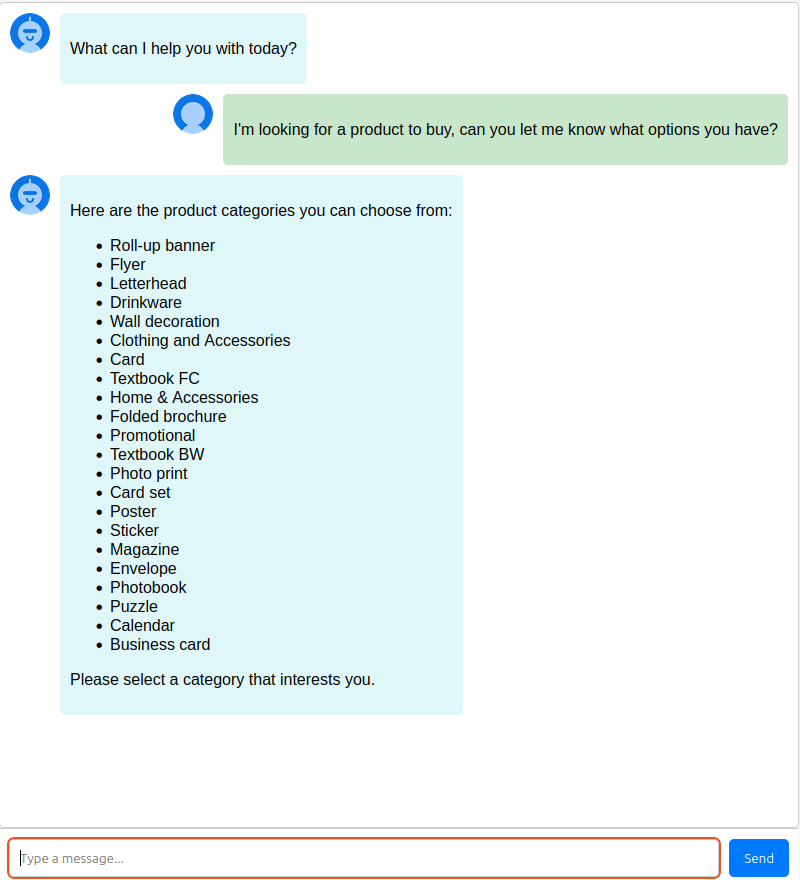
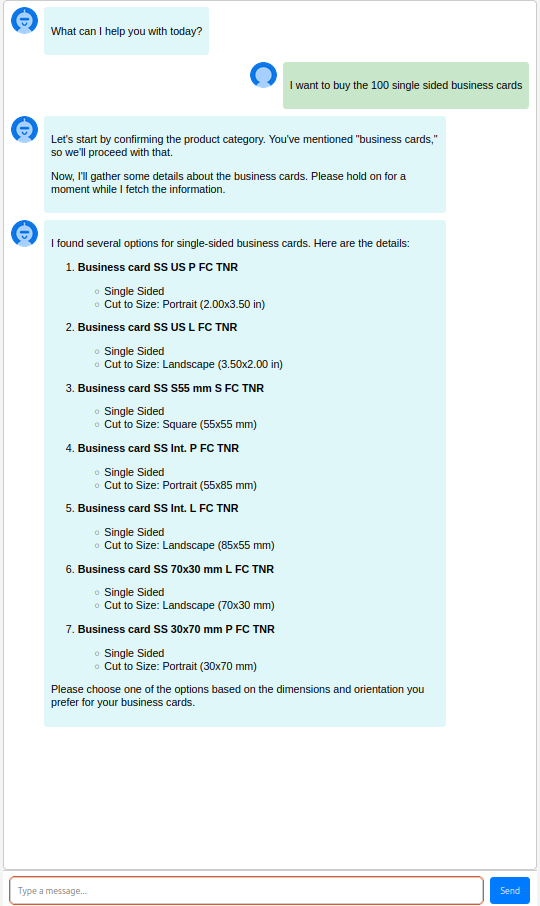

# Order Management System (OMS) Agent - Autogen

This project demonstrates an Order Management System powered by intelligent agents. Leveraging AG2 (formerly Autogen), the system orchestrates a seamless workflow using a custom manager flow for multi-agent group chats. The agents collaboratively handle tasks such as processing orders, managing customer interactions, and coordinating various steps of the order lifecycle. This setup showcases the potential of agent-based systems to streamline and automate complex workflows with efficiency and intelligence.

---

## Prerequisites

-   Python 3.12 or above
-   uv
-   An OpenAI API key
-   A Cloudprinter API key
-   LangSmith API Key

---

## Project Architecture

```
PrintBotAIAgents-AutoGen/
├── src/
│   ├── app.py             # Flask application with AutoGen and Socket.IO
│   ├── functions.py       # Functions for interacting with the Cloudprinter API.
│   ├── prompts.py         # Prompts for AutoGen agents.
│   ├── logger.py          # Logger setup.
│   ├── templates/
│   │   └── index.html     # HTML template for the chat interface.
│   ├── static/
│   │   └── user.png
│   │   └── agent.png
│   ├── .env               # Environment variables.
│   └── requirements.txt   # Project dependencies.
└── README.md
```

---

## Technology Stack  

### Backend  
- **Python**: Core programming language for building the agent workflows and server-side logic.  
- **Flask**: Lightweight web framework to manage the server and handle API endpoints.  
- **AG2 (formerly AutoGen)**: Advanced multi-agent framework enabling custom workflows and communication in group chats.  
- **Socket.IO**: Facilitates real-time bidirectional communication between the client and server for seamless interactions.  

### Agents  
- **ConversableAgent**: Customized agents designed to execute tasks such as processing orders, tool calls, and handling user interactions.  
- **Custom Speaker Selection Logic**: Implements a structured flow between agents like `the_human`, `assistant_agent`, and `executor_agent`.  

### APIs and Models  
- **OpenAI API**: Integrates GPT-based language models to power natural language understanding and task execution.  
- **CloudPrinter API**: The core API microservice for placing orders, requesting product lists, requesting status and more.

### Frontend  
- **HTML/CSS**: Templates for the user interface.  
- **JavaScript**: Enables dynamic features and integrates with Socket.IO for real-time updates.  

---  

## AG2 (formly Autogen)

The end-to-end platform for multi-agent automation. Flexible agent construction and orchestration. Create specialized agents that work together seamlessly. TO learn more about AG2, visit AG2 official [docs](https://docs.ag2.ai/docs/home/home).

### Why Use AG2  

AG2 stands out for its scalability, allowing seamless integration with APIs, databases, and external tools to automate complex workflows. It provides customizable agent workflows and real-time task execution, making it reliable for handling intricate processes. Its advanced error handling ensures robust operations, while extensive documentation and an active community streamline the development experience. Whether you are building a simple chatbot or orchestrating a multi-agent system, AG2 delivers flexibility, efficiency, and ease of use.

### Use of Socket.IO (Limitations in AG2)

During the implementation of agentic flows with AG2, it became evident that the platform lacks a streaming option for real-time conversation updates. This limitation prevents extracting agent conversations and human inputs for display in a user interface. To address this, the `_print_received_message` function was customized and integrated with Socket.IO, enabling seamless real-time updates of conversations in the UI.  

### CloudPrinter Integration

Cloudprinter.com provides a versatile platform with seamless one-click integrations for popular marketplaces, shop systems, and e-commerce solutions, enabling instant printing services. For our project, we leveraged the **`List all products`** API to fetch a comprehensive catalog of products, including: 

**Roll-up Banners, Flyers, Letterheads, Drinkware, Wall Decorations, Clothing and Accessories, Cards, Textbooks (FC and BW), Home & Accessories, Folded Brochures, Promotional Items, Photo Prints, Card Sets, Posters, Stickers, Magazines, Envelopes, Photobooks, Puzzles, Calendars, and Business Cards.**

Additionally, we utilized the **`Product Info`** API to retrieve detailed information for specific products to ensure accurate order management and workflow precision and **`Order Quote`** API to retrieve the pricing information for the specific product.

To explore more about the Cloudprinter API, visit their [official website](https://www.cloudprinter.com).

## Setup and Installation

This project use `uv` as it's package manager instead of traditional `pip`. Learn more about [uv](https://docs.astral.sh/uv/)

1.  **Clone the repository:**

    ```bash
    git clone https://github.com/faizrazadec/OrderManagementSystemAgents-AutoGen.git
    cd OrderManagementSystemAgents-AutoGen/src
    ```

2.  **Create a virtual environment (recommended):**

    ```bash
    uv venv
    ```

3.  **Install dependencies:**

    ```bash
    uv pip install -r pyproject.toml
    ```

4.  **Set up environment variables:**

    -   Create a `.env` file in the project's root directory.
    -   Add your OpenAI and Cloudprinter API keys:

        ```
        CLOUDPRINT_API_KEY=your_cloudprint_api_key
        OPENAI_API_KEY=your_openai_api_key

        LANGSMITH_TRACING='true'
        LANGSMITH_ENDPOINT="https://api.smith.langchain.com"
        LANGSMITH_API_KEY=your_langsmith_api_key
        LANGSMITH_PROJECT=your_project_name
        ```

## Running the Application

1.  **Start the Flask application:**

    ```bash
    uv run /path/to/file/app.py
    ```

2.  **Open `index.html` in your browser:**

    -   Navigate to `http://127.0.0.1:5000/` in your web browser.

---

## Use Cases

<p align="center">
  
</p>

---

<p align="center">
  
</p>

---
